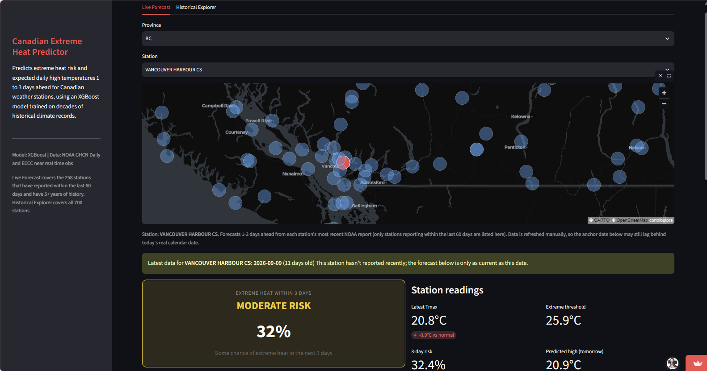
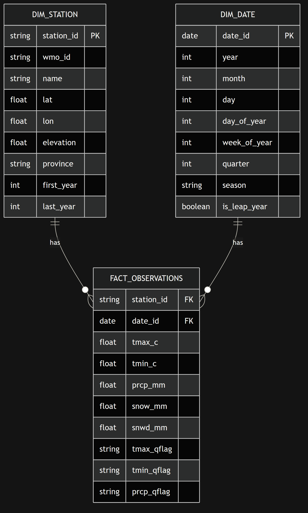

# Canadian Climate ML

This is a full-stack data science project that forecasts extreme heat risk 1-3 days ahead at Canadian weather stations using 150 years of historical climate data.

I built this to demonstrate the kind of end to end work I did during my co-op at Environment and Climate Change Canada and further build on it. Here I take raw environmental data, structure it properly, feature engineer at scale, and get models into production. The stack mirrors what I have seen so far in data engineering or applied ML projects/roles as there is a relational data warehouse, SQL based feature engineering, models served through an API, and a live dashboard on top.



---


## What it does

Given a Canadian weather station, the app forecasts extreme heat risk for each of the next 3 days - both the probability that a given day's max temperature will exceed that station's historical 95th percentile threshold for that time of year, and the actual predicted high temperature in °C. I also added a separate 'extreme heat within 3 days' probability, since that's often the more useful question in practice.

Using a station relative threshold rather than a fixed cutoff (e.g. 'above 35°C') means the model understands that 28°C in Yellowknife in July is extreme, but the same temperature in Windsor would be unremarkable. The threshold is computed separately for each station and each day of the year from its full historical record.

The dashboard has two modes - Live forecast and Historical Explorer. **Live Forecast** anchors on each station's most recent observation and projects 1-3 days ahead. **Historical Explorer** lets you pick any past date at any station and backtest the model's call against what actually happened. Both include a clickable station map (pydeck/deck.gl on a CARTO dark basemap).

**As a test of real-world validity**: running the Historical Explorer for Burnaby's SFU station on June 27, 2021, which is the day before the BC heat dome peaked, returns a 97% extreme heat probability. The model was trained entirely on data before 2021.

---

## How it's built

```
NOAA GHCN-Daily (public)              ECCC GeoMet OGC API (near-real-time)
        │                                       │
        ▼                                       ▼
ingestion/download.py, ingest.py       ingestion/fetch_recent.py
 downloads + parses raw station CSVs    fills the gap between NOAA's
        │                                weeks-long publication lag
        ▼                                       │
        └───────────────────┬───────────────────┘
                             ▼
sql/schema/schema.sql   PostgreSQL star schema — dim_stations, dim_dates, fact_observations
                         + features_daily_base (all feature engineering), with
                           features_daily (training/backtest) and features_latest
                           (most recent row per station, for live forecasts) views on top
                             │
                             ▼
modeling/train.py       Pulls features via SQL, trains three XGBoost models:
                         a per-day extreme-heat classifier (horizons 1-3),
                         a "any extreme day in the next 3" window classifier,
                         and a tmax regressor (horizons 1-3)
                             │
                             ▼
api/main.py              FastAPI — /predict, /forecast, /stations, /health
                             │
                             ▼
dashboard/app.py         Streamlit — Live Forecast + Historical Explorer, station map
```

### Data

The dataset is NOAA's GHCN-Daily daily weather observations from Canadian weather stations going back to 1873, totalling around 18 million rows after ingestion. The raw data comes in one CSV per station, with temperatures stored in tenths of degrees Celsius and quality flags for each reading. `ingestion/fetch_recent.py` supplements this with near real time observations from Environment and Climate Change Canada's GeoMet OGC API (matching stations by the last 7 characters of their GHCN ID, which is ECCC's climate identifier), since GHCN's own publication lag is several weeks.

### Database design

Raw observations load into a star schema in PostgreSQL, consisting of a `fact_observations` table (one row per station per day) with foreign keys into `dim_stations` and `dim_dates` dimension tables. I designed the schema from an ER diagram which I have attached below.



### Feature engineering

All feature engineering happens in SQL, in `features_daily_base` and the views built on it. I did this because all the heavy computation runs once in the database using `LAG()`/`LEAD()`, rolling window averages, and `PERCENTILE_CONT()` in SQL, and the model training script just executes a `SELECT`. It computes:

- Lag features: yesterday's tmax, the day before, and three days back
- Rolling averages: 7-day and 30-day rolling mean tmax
- Climatology baseline: historical average tmax for each station and day-of-year
- Anomaly: how far today's temperature deviates from that baseline
- The 95th percentile threshold used to define "extreme"
- Forward-looking targets per horizon (1-3 days out): the actual future tmax (`tmax_h1`-`tmax_h3`) and whether it clears the threshold (`is_extreme_h1`-`is_extreme_h3`), plus a windowed `is_extreme_next_3d`

`features_daily` requires known future outcomes (used for training/backtesting), while `features_latest` exposes only the single most recent row per station with no future data required which is what the Live Forecast tab queries.

### Models

Three XGBoost models, trained on a stratified sample of the full history. Splits are chronological, never random so the train covers 1873-2015, validation covers 2016-2020, and test covers 2021-2026. 

1. **Per-day extreme-heat classifier** takes the horizon (1, 2, or 3) as a feature and predicts whether *that specific day* will be extreme.
2. **Window classifier** predicts whether *any* of the next 3 days will be extreme.
3. **Tmax regressor** predicts the actual high temperature in °C for each horizon.

Since extreme heat target makes up about only 6.6% of the data, models are evaluated on AUC-ROC, F1, and recall for the classifiers, and MAE/RMSE for the regressor, with `scale_pos_weight` compensating for the imbalance.

**Results against the held-out test set (2021–2026):**

| Model | Metric | Score |
|---|---|---|
| Per-day classifier (blended, h1-h3) | AUC-ROC | 0.80 |
| Per-day classifier, 1-day-out only | AUC-ROC | 0.87 |
| Window classifier (extreme within 3 days) | AUC-ROC | 0.79 / recall 0.77 |
| Tmax regressor (blended, h1-h3) | MAE | 3.41°C |
| Tmax regressor, 1-day-out only | MAE | 2.73°C |

Model accuracy drops as the forecast horizon increases so predicting one day out (AUC 0.87) is more reliable than predicting three days out (AUC 0.72).

The temperature regressor was compared against two simple baselines that require no machine learning. The first, a persistence baseline, just assumes tomorrow will be the same temperature as today and it's wrong by an average of 3.75°C. The second, a climatology baseline, predicts the long run historical average for that station and time of year and is wrong by 4.09°C on average. The trained model outperforms both, coming in at 2.73°C average error, which confirms it's learning the patterns.

The single most influential feature (30% of the model's decisions) is how far today's temperature already deviates from normal which is the tmax_anomaly. This makes sense because extreme heat events build over consecutive days. The forecast horizon itself is the second most important feature (17%), which reflects the model learning to be less confident the further out it's predicting.

### API and dashboard

The trained models are served through a FastAPI app with four endpoints: `/predict` (backtest a known past date against actual outcomes), `/forecast` (forward looking forecast anchored on a station's latest data), `/stations`, and `/health`. The Streamlit dashboard sits on top with the Live Forecast and Historical Explorer tabs described above, a clickable station map, and station level context like a temperature history chart and the number of extreme days in that year.

---

## Live demo

**[canadaclimateforecast.streamlit.app](https://canadaclimateforecast.streamlit.app)**

A good place to start -> open the **Historical Explorer** tab, select province **BC**, station **BURNABY SIMON FRASER U**, and date **2021-06-27**. That's the day before the BC heat dome peaked, the model returns 97% probability of extreme heat, which is what actually happened. The **Live Forecast** tab shows 1-3 day forecasts for any currently reporting station.

The deployed app runs against a trimmed copy of the database (2018 onward, to fit a free tier host) covering around 700 stations, of which roughly 258 have reported recently enough to appear in Live Forecast. Historical Explorer covers all of those stations across their full available history.

---


## Running it yourself

The live app is at [canadaclimateforecast.streamlit.app](https://canadaclimateforecast.streamlit.app), but if you want to run the full pipeline locally including ingestion, database setup, and model training, here's how.

You'll need Docker and Python 3.11+.

```bash
#Start Postgres
docker compose up -d

#Install dependencies
pip install -r requirements.txt

#Download Canadian station data (starts with 50 stations by default)
python -m ingestion.download

#Load into Postgres and build the feature views
python -m ingestion.ingest

#Optional: pull near-real-time data from ECCC to fill the gap since the last NOAA refresh
python -m ingestion.fetch_recent

#Train the models
python modeling/train.py

#Start the API
python -m uvicorn api.main:app --reload --port 8000

#Start the dashboard
python -m streamlit run dashboard/app.py
```

The deployed version connects to a hosted Supabase database. Running locally, `docker compose up -d` spins up a Postgres instance instead and `DATABASE_URL` falls back to that local connection automatically.

---

## Deployment

- **Database**: [Supabase](https://supabase.com) (Postgres), accessed via its session pooler.
- **API**: [Render](https://render.com), free tier, spins down after 15 minutes idle, so the first request after a lull has a cold start of about a minute.
- **Dashboard**: [Streamlit Community Cloud](https://streamlit.io/cloud).

---

## Project structure

```
ghcn_ml/
├── ingestion/
│   ├── download.py        downloads station inventory + daily CSVs from NOAA
│   ├── ingest.py           parses CSVs, loads into Postgres, refreshes feature views
│   └── fetch_recent.py    pulls near-real-time obs from ECCC's GeoMet API
├── sql/
│   └── schema/
│       └── schema.sql      star schema + features_daily_base / features_daily / features_latest views
├── modeling/
│   ├── train.py             stratified sampling, chronological split, trains all three models
│   └── saved_models/        trained model files + metrics/feature-importance JSON
├── api/
│   └── main.py               FastAPI endpoints
├── dashboard/
│   └── app.py                 Streamlit dashboard (Live Forecast, Historical Explorer, station map)
├── assets/
│   └── climateml-er.png       entity-relationship diagram
├── docker-compose.yml
└── requirements.txt
```

---

## What I'd do with more time

- Schedule ingestion (both the NOAA refresh and the ECCC near-real-time pull) so the database stays current without manual runs
- Move the deployment off the current free-tier patchwork (Render + Streamlit Community Cloud) onto something like ECS Fargate behind an ALB, with the ECCC refresh running on a schedule via EventBridge instead of manually
- Add regional warming trend analysis: which parts of Canada are warming fastest, and has the rate accelerated since 1980
- Sync the trimmed deployed database with the full local history, or make the trim window configurable, rather than a fixed 2018+ cutoff

---

## Stack

Python · PostgreSQL · Supabase · Docker · XGBoost · FastAPI · Streamlit · SQLAlchemy · pandas · Plotly · pydeck/deck.gl · Render
