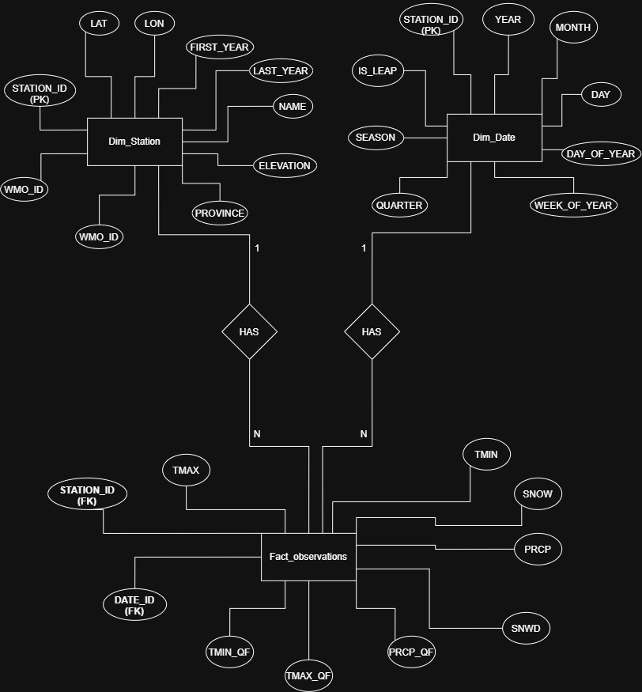

# Canadian Climate ML

In this end to end data science project, I explore NOAA GHCN-Daily weather data → Postgres star schema → SQL feature engineering → XGBoost classification & regression → FastAPI serving.

**Forecasts extreme heat risk and actual max temperature 1–3 days ahead** for Canadian weather stations. "Extreme" = a day whose maximum temperature exceeds that station's historical 95th percentile for the time of year. The live `/forecast` endpoint/dashboard tab always predicts forward from each station's most recent real observation; a separate `/predict` endpoint/tab lets you replay any past date as a backtest against the model.

Three models are trained:

- **Per-day classifier** — one XGBoost that takes the forecast horizon (1, 2 or 3 days) as an input feature and predicts whether *that* day will be extreme.
- **Window classifier** — a second XGBoost predicting whether *any* of the next 3 days will be extreme.
- **Per-day regressor** — a third XGBoost, same horizon-as-a-feature design, predicting the actual max temperature (°C) at day+1/2/3, evaluated against persistence and climatology baselines.

## Architecture

```
NOAA GHCN-Daily                  ECCC GeoMet OGC API
(full history, laggy)            (near-real-time, ~1-3 day lag)
      │                                  │
      ▼                                  ▼
ingestion/download.py    ingestion/fetch_recent.py
+ ingestion/ingest.py     (keeps fact_observations fresh
      │                    between full GHCN refreshes)
      │                                  │
      └────────────────┬─────────────────┘
                        ▼
sql/schema.sql           ← dim_stations, dim_dates, fact_observations
      │                     features_daily_base (materialized view, all present-computable
      │                     features per station/date + targets h1–h3 + next_3d where known)
      │                       ├─ features_daily  (view: rows with known future truth — training/backtest)
      │                       └─ features_latest (view: latest row per station — live forecast anchor)
      ▼
modeling/train.py        ← pulls features via SQL, trains per-day classifier +
      │                     window classifier + per-day tmax regressor
      ▼
api/main.py              ← FastAPI: /predict (backtest, by date) + /forecast (live, by station)
      │
      ▼
dashboard/app.py         ← Streamlit: Live Forecast tab + Historical Explorer tab
```

## Stack

- **Storage**: PostgreSQL 16 (Docker)
- **Ingestion**: Python, psycopg2
- **Feature engineering**: SQL window functions, CTEs, materialized views
- **Modeling**: XGBoost, scikit-learn, chronological train/test split
- **Serving**: FastAPI
- **Dashboard**: Streamlit

## Quickstart

```bash
# 1. Start Postgres
docker compose up -d

# 2. Install Python dependencies
python -m venv venv && source venv/bin/activate
pip install -r requirements.txt

# 3. Download data (starts with 50 stations) - run as a module (-m), not a
#    bare script path, so the top-level `config` import resolves
python -m ingestion.download

# 4. Ingest into Postgres
python -m ingestion.ingest

# 4b. (optional) Top up with ECCC near-real-time data so the Live Forecast
#     tab isn't stuck at NOAA's lag - see "Data freshness" below
python -m ingestion.fetch_recent

# 5. Train the models (per-day classifier + window classifier + tmax regressor)
python modeling/train.py

# 6. Start the API
uvicorn api.main:app --reload

# 7. Launch dashboard
streamlit run dashboard/app.py
```

## Data freshness

Ingestion is manual and not scheduled — there is no cron/Airflow job.

**Full refresh (NOAA GHCN-Daily)**: `ingestion/download.py` skips any per-station CSV that already exists under `data/raw/daily/`, so simply rerunning it does **not** pull fresher NOAA data. To refresh a station (or all of them):

```bash
rm data/raw/daily/<station_id>.csv   # or all of data/raw/daily/*.csv
python -m ingestion.download
python -m ingestion.ingest           # re-ingests + refreshes features_daily_base
```

This is the source of truth for training data (full history, quality-controlled), but NOAA's own pipeline lags real time by anywhere from days to a few weeks depending on the station.

**Fast top-up (ECCC near-real-time)**: `ingestion/fetch_recent.py` pulls the last 14 days of daily observations from Environment and Climate Change Canada's public GeoMet OGC API (`climate-daily` collection) and upserts them into the same `fact_observations` table — no schema, model, or API changes needed, since everything downstream just reads whatever is freshest in that table. One request per date returns every reporting Canadian station at once (verified up to `limit=10000`), so a 14-day pull is ~14 HTTP requests, not one per station:

```bash
python -m ingestion.fetch_recent
```

Notes on this feed:
- **Station matching**: GHCN's Canadian station IDs are `CA` + padding + ECCC's 7-digit climate identifier, e.g. `CA001100119` → `1100119` (just the last 7 characters) — verified against ECCC's `climate-stations` collection for multiple stations before relying on it.
- **Provisional data**: ECCC's near-real-time values can be revised after the fact (values are typically finalized within ~1-3 days), and can differ slightly (observed ~0.5-1°C) from GHCN's own reprocessed values for the same date, which is expected pipeline/rounding noise, not a bug. The next full GHCN refresh will naturally supersede any provisional value once that date's finalized reading is re-ingested (same `ON CONFLICT DO UPDATE` upsert either pipeline uses).
- **History-depth guard**: this feed can technically surface a station that's in `dim_stations`' filtered candidate list but was never fully downloaded via `ingestion/download.py` — it would only have a couple of weeks of data, making its climatology/p95 threshold statistically meaningless (based on ~1 sample per day-of-year). `dashboard/app.py`'s Live Forecast station picker guards against this: it requires both recent data (`FORECAST_MAX_AGE_DAYS`, 60 days) **and** at least `MIN_HISTORY_YEARS` (5) distinct years of real history before a station is selectable there.

The Live Forecast tab's station picker only lists stations passing both of those checks, since forecasting from a station whose last report is old or whose climatology is meaningless wouldn't be an honest "live" forecast — it still shows `as_of_date`/staleness for whichever station you pick. The Historical Explorer tab lists all stations regardless of recency or history depth, since it's explicitly a backtest against known history.

## Key design decisions

- **Star schema** (fact + dimension tables) rather than a flat table 
- **Feature engineering in SQL** (window functions, LAG, rolling aggregates) rather than pandas — SQL handles this more efficiently at scale and is closer to how real pipelines work
- **Chronological train/test split** — avoids data leakage that would occur with a random split on time-series data
- **Calendar-aware targets** — future-day labels are validated against the actual calendar date (`LEAD(date_id, N) = date_id + N`), so data gaps never mislabel the target
- **Single model across horizons** — the per-day model learns from all three horizons at once with `horizon` as a feature, rather than training three separate models
- **Baseline comparison** — models are evaluated against an always-normal baseline to demonstrate actual predictive skill


